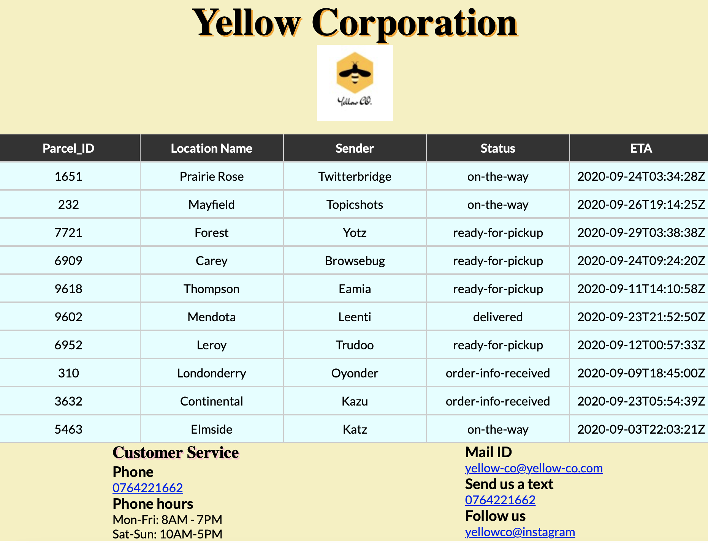

# Package Tracking App

The web app for any registered user allows to search for his/her packages that are being handled by Yellow Corporation.

# Brief Description

The app allows the user by name Jhon Doe to track his packages on the company website.
The user can search for his packages by entering his name, the app then displays all the package details.
The user is able to see the following package details
i)  package_id
ii) location name
iii)sender
iv) status
v)  eta

There are 2 pages for the application.
The Home page is where the user Jhon Doe enters his name and then clicks on the Track button to view the list of all packages.
The Result page is where the packages are displayed.

# User Guide

The application was built using react modules and components. 
The "react-router-dom" was installed to allow routing between the pages using the command:

### `npm install react-router-dom`

The app fetches information from the mock server using the end point https://my.api.mockaroo.com/orders.json?key=e49e6840.
The endpoint provides package objects only with one user name which is "Jhon Doe".
So to access all the packages we use Jhon Doe name.

# How to Run the Application

Install all the dependencies with
### `npm install`

Launch the app from the command line with
### `npm start`

Runs the app in the development mode.\
Open [http://localhost:3000](http://localhost:3000) to view it in the browser.

The page will reload if you make edits.\
You will also see any lint errors in the console.

This is how the result page looks after you run the application.

## Learn More

You can learn more in the [Create React App documentation](https://facebook.github.io/create-react-app/docs/getting-started).

To learn React, check out the [React documentation](https://reactjs.org/).

